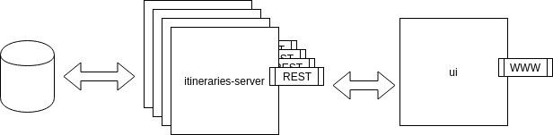

# What is this?

`miniapp` is a synthetic workload to test Federation-v2. The _architecture_ is (for the moment) very simple:

`itineraries-server` is the cpu intensive computing resource which speaks with the DB (currently a MongoDB)

`ui` is the `WWW` server.

#

# How to install it

## How to inject data in DB (locally)

## To deploy it locally

